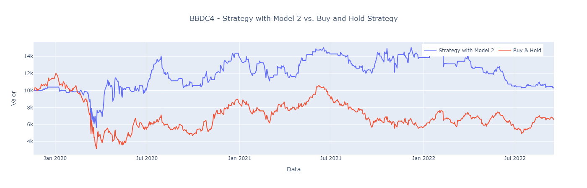
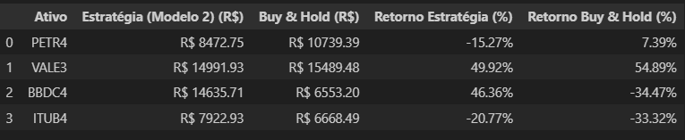

# IEEE_ID9184
Brazilian Stock Market Forecast with Heterogeneous Data Integration for a Set of Stocks

## 📁 Estrutura do Repositório  

A organização das pastas e arquivos é a seguinte:  

### 📂 **Diretórios**  

- **`data_collection/`** → Código-fonte para extração e preparação dos dados brutos.  
- **`data/`** → Contém os arquivos de dados processados prontos para o treinamento e testes dos modelos.  
- **`output/`** → Pasta onde são armazenados os resultados dos treinamentos, incluindo modelos e scalers.  

### 📄 **Arquivos Principais**  

- **`config.py`** → Arquivo de configuração que define os caminhos das pastas como parâmetros globais.  
- **`utils.py`** → Funções auxiliares utilizadas no projeto para processamento e manipulação de dados.  
- **`utils_backtest.py`** → Código específico para a realização do backtest da estratégia.  
- **`models.py`** → Código-fonte dos quatro modelos de previsão utilizados no projeto.  
- **`main.ipynb`** → Notebook principal para execução do treinamento e avaliação dos modelos.  
- **`backtest.ipynb`** → Notebook principal para execução do backtest e análise dos resultados.  
- **`requirements.txt`** → Lista das bibliotecas e dependências necessárias para rodar o projeto.  

---


## 🚀 Como Executar  

1.  Clone o repositório:

    ```bash
    git clone https://github.com/MarcosSouza257/IEEE_ID9184.git
    ```

2.  Navegue até o diretório do projeto:

    ```bash
    cd IEEE_ID9184
    ```
3. Crie um ambiente virtual:

    ```bash
    python -m venv venv
    source venv/bin/activate  # No Windows: venv\Scripts\activate
    ```


4.  Instale as dependências:

    ```bash
    pip install -r requirements.txt

## Como Usar  

1. **🚀 Treine os Modelos**  

   - Abra o notebook `main.ipynb` e execute as células para treinar os modelos do zero.  
   - Se quiser visualizar apenas os resultados já gerados sem precisar treinar novamente:  
     - Execute apenas a primeira célula (`importações`).  
     - Pule para a seção **"2. Carregando os Resultados Salvos"** e execute as células a partir desse ponto.  
   - Isso permitirá que você visualize gráficos dos resultados, desempenho dos modelos, combinações e ações previstas sem necessidade de um novo treinamento.  
s.
2. **📊 Backtest**  

   - Abra o notebook `backtest.ipynb` e execute as células para treinar e salvar o modelo com a combinação desejada.  
   - Na seção **"2. Processar o Treino do Modelo para Salvar os Artefatos"**, você poderá escolher entre **4 modelos** (`model_1`, `model_2`, `model_3`, `model_4`) e **7 combinações de dados disponíveis**:  

     1. **Stock Data**  
     2. **Stock Data + Google News**  
     3. **Stock Data + Twitter**  
     4. **Stock Data + (IFR + MMS + MME)**  
     5. **Google News + Twitter + IFR + MMS**  
     6. **Google News + Twitter + IFR + MME**  
     7. **Google News + Twitter + IFR + MME + MMS**  

   - **Para visualizar os resultados de um modelo já salvo** (exemplo: `model_2` com a **combinação 5**):  
     1. Execute as **duas primeiras células**.  
     2. Pule para a seção **"3. Processar o Backtest com Modelo Salvo"**.  
     3. Execute as células dessa seção para visualizar **4 gráficos**, cada um representando o desempenho da estratégia para as ações estudadas (`PETR4`, `VALE3`, `BBDC4` e `ITUB4`). Os gráficos comparam a estratégia com o retorno real de cada ação. 

3. **📈 Comparação de Resultados**  

   - Ao executar a última célula, será exibida uma **tabela comparativa** mostrando o resultado final acumulado.  
   - Na simulação, consideramos um **capital inicial de R$ 10.000,00**.  
   - A tabela apresentará dois cenários:  
     - O **desempenho da estratégia aplicada** ao longo do período de teste.  
     - O **resultado de um investimento passivo**, onde os R$ 10 mil seriam investidos diretamente na ação.  
   - Com isso, você poderá comparar se a estratégia foi capaz de superar o retorno do investimento direto na ação.

    
   * Obs.: **Modelo 2** com a combinação de dados **5. - Google News + Twitter + IFR + MMS**, sem considerar o custo operações.


